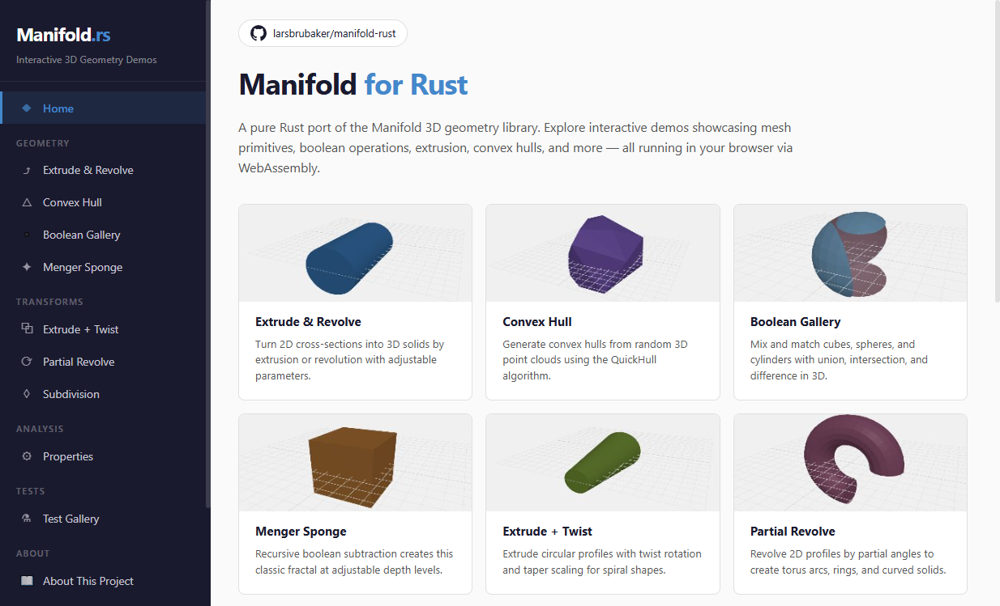

# manifold-rust

[](https://larsbrubaker.github.io/manifold-rust/)

Pure Rust port of [Manifold](https://github.com/elalish/manifold) — a geometry library for 3D boolean operations on triangle meshes.

> Part of the [rust-apps](https://github.com/larsbrubaker/rust-apps) suite — a collection of Rust graphics and geometry libraries by Lars Brubaker.

> **Status: Port in progress.** See [PORTING_PLAN.md](PORTING_PLAN.md) for current phase.

## What is Manifold?

Manifold is a high-performance C++ library for 3D solid modeling. It supports:

- Boolean operations (union, intersection, difference) on triangle meshes
- Mesh constructors (sphere, cube, cylinder, extrude, revolve)
- Cross-section (2D polygon) operations
- Smooth subdivision and SDF-based mesh generation
- Convex hull
- Minkowski sum/difference

This Rust port targets **exact numerical match** with the C++ implementation — same algorithms, same floating-point results, same triangle topology.

## Why

[MatterHackers](https://www.matterhackers.com) uses 3D mesh boolean operations extensively in production for 3D printing workflows. A pure Rust implementation avoids FFI overhead and integrates cleanly with Rust tooling including WASM compilation.

## Usage

```rust
// Coming soon — library is being ported incrementally
```

## Demo

An interactive WASM demo will be available at <https://larsbrubaker.github.io/manifold-rust/> once the port reaches a usable state.

## Building

```bash
cargo build
cargo test
```

Restore the upstream C++ reference before doing exact-match validation:

```bash
git submodule update --init --recursive
```

Build and compare against the C++ reference with:

```powershell
./validate-reference.ps1
```

You can also run a narrower validation slice by phase, for example:

```powershell
./validate-reference.ps1 -Phase phase8
```

This configures and builds `cpp-reference/manifold`, runs the matching C++
reference tests, and then runs the corresponding Rust tests for the selected
phase.

For the WASM demo:
```bash
cd demo
bun run build:wasm
bun run dev
```

## Architecture

The port follows the C++ module structure:

| Rust module | C++ source | Description |
|-------------|-----------|-------------|
| `vec` / `linalg` | `linalg.h`, `vec.h` | Vector math, linear algebra |
| `polygon` | `polygon.cpp` | 2D polygon triangulation |
| `impl` | `impl.cpp`, `impl.h` | Core mesh data structure |
| `constructors` | `constructors.cpp` | Primitive mesh constructors |
| `boolean3` | `boolean3.cpp` | 3D boolean operations |
| `boolean_result` | `boolean_result.cpp` | Boolean output assembly |
| `csg_tree` | `csg_tree.cpp` | CSG tree evaluation |
| `edge_op` | `edge_op.cpp` | Edge manipulation |
| `face_op` | `face_op.cpp` | Face manipulation |
| `smoothing` | `smoothing.cpp` | Smooth normals and subdivision |
| `subdivision` | `subdivision.cpp` | Mesh subdivision |
| `properties` | `properties.cpp` | Mesh properties |
| `sdf` | `sdf.cpp` | SDF-based mesh generation |
| `quickhull` | `quickhull.cpp` | Convex hull |
| `minkowski` | `minkowski.cpp` | Minkowski operations |
| `cross_section` | `cross_section/` | 2D cross section |

## License

Apache-2.0 — matching the original Manifold library.

## Credits

- **[Emmett Lalish](https://github.com/elalish)** — Author of the original Manifold library.
- **[Lars Brubaker](https://github.com/larsbrubaker)** — Port author.
- **[MatterHackers](https://www.matterhackers.com)** — Sponsor.
