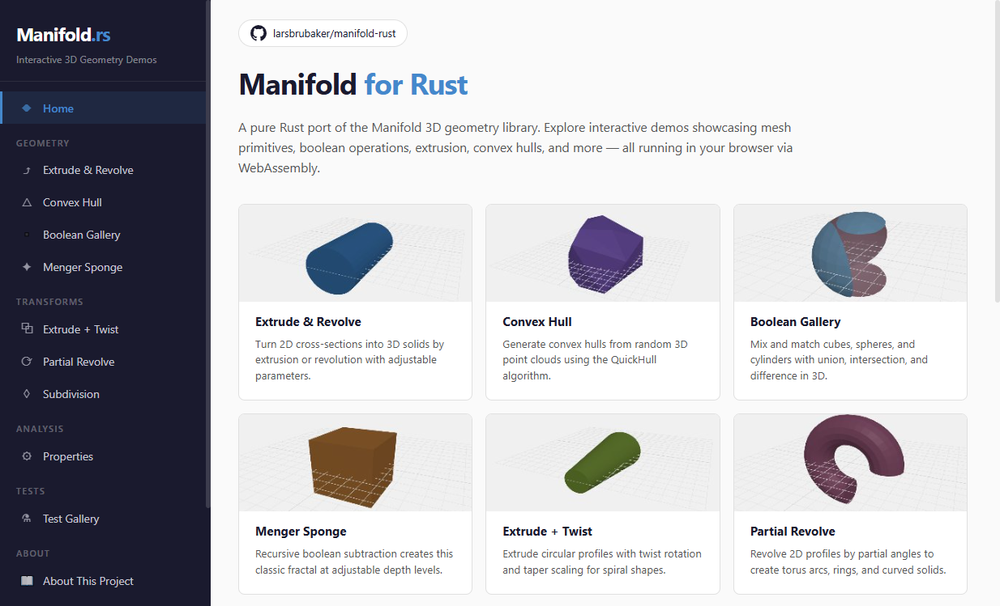

# manifold-rust

[](https://crates.io/crates/manifold-rust)
[](https://docs.rs/manifold-rust)
[](https://www.nuget.org/packages/ManifoldRust)
[](https://github.com/larsbrubaker/manifold-rust/blob/main/LICENSE)

**3D mesh booleans in pure Rust — exact on clean geometry, robust on real-world geometry.**

[](https://larsbrubaker.github.io/manifold-rust/)

<p align="center"><a href="https://larsbrubaker.github.io/manifold-rust/"><b>▶ Try the live demo</b></a></p>

## What this is

Two things in one library:

1. **A pure-Rust port of [Manifold](https://github.com/elalish/manifold)** (Emmett Lalish's
   C++ geometry kernel, v3.5.0) — union / intersection / difference on triangle meshes,
   plus constructors, cross-sections, convex hull, Minkowski, SDF meshing and smooth
   subdivision. The port targets *exact numerical match*: same algorithms, same
   floating-point results, same triangle topology, validated by instrumented
   boolean-by-boolean trace comparison against a locally built C++ reference.

2. **A second, original "robust" boolean engine** that the C++ library does not have. It
   accepts the meshes real pipelines actually contain — triangle soup, scans, Thingiverse
   downloads: non-manifold connectivity, self-intersections, doubled sheets, disconnected
   shells, internal voids, inside-out bodies. It computes on exact rational arithmetic with
   a mesh-arrangement formulation (Zhou, Grinspun, Zorin & Jacobson 2016), so its answers
   are decided by exact predicates rather than by tolerances.

## Why you'd use it

- **The exact engine matches the C++ reference**, down to the tie-breaking order of the
  symbolic-perturbation predicates — so results are reproducible against the reference
  implementation the rest of the ecosystem uses, with no FFI and clean WASM builds.
- **The robust engine handles what the exact engine can't.** It has been swept over the
  whole [Thingi10K](https://ten-thousand-models.appspot.com/) corpus (~10k meshes):
  **0 `NotClosed` failures**, and every volume disagreement above the sampling-noise floor
  was arbitrated by an independent Monte-Carlo referee — **in the robust engine's favour in
  every case** (~150 arbitrated meshes). The typical exact-engine failure on such input is
  2–3× volume overcounting on self-overlapping shells.
- **`Auto` gives you clean data by default.** It picks the fast exact engine only when that
  is provably safe (both operands manifold *and* free of self-intersections, a cached
  ~0.2 ms exact scan), and the robust engine otherwise. You do not have to know which kind
  of mesh you were handed.

## Features

- Booleans: union, intersection, difference (also `+` `-` `^` operators), n-ary batch and
  CSG-tree evaluation
- Constructors and modeling: cube / sphere / cylinder, extrude, revolve, convex hull,
  Minkowski sum & difference, SDF level sets, smooth subdivision, 2D cross-sections
- Mesh repair utilities: `repair_orientation()` for inside-out bodies,
  `has_self_intersections()` as an exact self-scan
- Cooperative **cancellation** and coarse **progress reporting** through the whole boolean
  pipeline (library → C FFI → WASM → demo)
- Optional `parallel` feature (rayon) — results stay **bit-identical** to the sequential
  build; only determinism-preserving sites are parallelized
- **C FFI** (`ffi/manifold_rs.h`) and **C#/.NET bindings** ([`dotnet/`](dotnet/README.md),
  [ManifoldRust on NuGet](https://www.nuget.org/packages/ManifoldRust))
- **WASM**: an interactive demo runs the whole engine in the browser —
  <https://larsbrubaker.github.io/manifold-rust/>

## Quickstart — Rust

```bash
cargo add manifold-rust
```

```rust
use manifold_rust::linalg::Vec3;
use manifold_rust::manifold::Manifold;
use manifold_rust::types::Error;

let cube = Manifold::cube(Vec3::new(1.0, 1.0, 1.0), true);
let sphere = Manifold::sphere(0.6, 32);

let result = cube.difference(&sphere);
assert_eq!(result.status(), Error::NoError);

println!("volume = {}", result.volume());
println!("area   = {}", result.surface_area());

let mesh = result.get_mesh_gl(0); // vert_properties / tri_verts, ready for a GPU
```

Messy input — import as soup and let `Auto` choose the engine:

```rust
use manifold_rust::types::{BooleanConfig, BooleanEngine};

// Imports geometry the strict pipeline would reject as NotManifold.
let scan = Manifold::from_mesh_gl_robust(&mesh);

// Per call…
let cut = scan.difference_with_engine(&cutter, BooleanEngine::Auto);

// …or once, process-wide.
BooleanConfig::set_default_engine(BooleanEngine::Auto);
let cut = scan.difference(&cutter);
```

Geometry that is not even closed imports as empty with `Error::NotClosed`. The default
engine remains `Exact`, so existing code is unchanged.

Parallel execution (bit-identical results, roughly 2× on heavy boolean workloads):

```toml
[dependencies]
manifold-rust = { version = "0.12", features = ["parallel"] }
```

## Quickstart — C# / .NET

```bash
dotnet add package ManifoldRust
```

```csharp
using ManifoldRust;

using Manifold body = Manifold.FromMesh(vertProperties, triVerts);
using Manifold hole = Manifold.FromMesh(holeVerts, holeTris);

// Check Status on every operand: a failed import is absorbed as empty geometry.
if (body.Status != ManifoldStatus.NoError || hole.Status != ManifoldStatus.NoError)
    throw new InvalidOperationException("bad input mesh");

Manifold.DefaultBooleanEngine = BooleanEngine.Auto;   // robust when it matters

using Manifold result = Manifold.BatchBoolean(new[] { body, hole }, ManifoldOpType.Subtract);
MeshGL mesh = result.GetMeshGL();
```

There is a double-precision path (`FromMesh64` / `GetMeshGL64`), a robust import
(`FromMeshRobust`), and `CancellationToken` support. Full binding documentation:
[`dotnet/README.md`](dotnet/README.md); the ABI itself is described in
[`ffi/manifold_rs.h`](ffi/manifold_rs.h).

## State of the project

- **Port: complete.** All 18 phases of the C++ engine (v3.5.0) are implemented and every
  C++ test is ported or covered — 686 tests passing, 0 failing (the handful of `#[ignore]`d
  tests are debug-build-speed only and pass in release). Details in
  [PORTING_PLAN.md](PORTING_PLAN.md).
- **Performance: at parity with the sequential C++ build.** Sphere-minus-sphere at 2 M
  input triangles: 2.61 s (C++) vs 2.57 s (Rust); a 7 999-sphere grid union: 13.5 s vs
  14.5 s — identical triangle counts throughout, peak memory within ~10%. The `parallel`
  feature roughly doubles throughput. Reproduce with
  `cargo run --release --example perf_test` and `--example large_scene_test`.
- **Robust engine: corpus-validated**, with the current numbers, open items and the
  referee tooling in [docs/ROBUST_ENGINE_STATUS.md](docs/ROBUST_ENGINE_STATUS.md).
- **Deliberate divergences from C++** (accuracy fixes, each with evidence) are catalogued
  in [docs/CPP_DIVERGENCES.md](docs/CPP_DIVERGENCES.md).

Known limits, honestly:

- Very large, heavily self-intersecting meshes can be **slow** in the robust engine —
  a handful of the ~10k corpus meshes exceed a 120 s budget and are reported as
  `Cancelled` rather than wrong. Speeding up the exact-predicate fallback is the top
  open item.
- The **WASM build is single-threaded**; the `parallel` feature is native-only.
- The robust engine requires input to be **closed**; anything else imports empty with
  `Error::NotClosed`.

## Building

```bash
cargo build
cargo test --release
```

Exact-match validation against the upstream C++ (needs the submodule):

```bash
git submodule update --init --recursive
```
```powershell
./validate-reference.ps1            # or: ./validate-reference.ps1 -Phase phase8
```

The WASM demo:

```bash
cd demo && bun run build:wasm && bun run dev
```

## Support the project

manifold-rust is open source, free to use, and maintained in spare time as a labor of love
(friends James Smith and Dan Ruskin help out from time to time).
[MatterHackers](https://www.matterhackers.com) sponsors the work — it uses mesh booleans
extensively in production 3D-printing workflows, which is why a dependable pure-Rust
kernel exists at all.

- **Donate:** [Buy Me a Coffee](https://buymeacoffee.com/larsbrubaker)
- **Star the repo** — costs nothing, helps others find it
- **Report issues:** [open an issue](https://github.com/larsbrubaker/manifold-rust/issues);
  the demo's *Copy Debug Info* button captures everything a boolean bug report needs
- **Contribute:** PRs welcome — open an issue first for larger changes

> Part of the [rust-apps](https://github.com/larsbrubaker/rust-apps) suite — Rust graphics
> and geometry libraries by Lars Brubaker.

## License and credits

Apache-2.0, matching the original Manifold library.

- **[Emmett Lalish](https://github.com/elalish)** — author of the original
  [Manifold](https://github.com/elalish/manifold) C++ library, which this port follows.
- **[Lars Brubaker](https://github.com/larsbrubaker)** — port author, robust engine.
- **[MatterHackers](https://www.matterhackers.com)** — sponsor.
</content>
</invoke>
